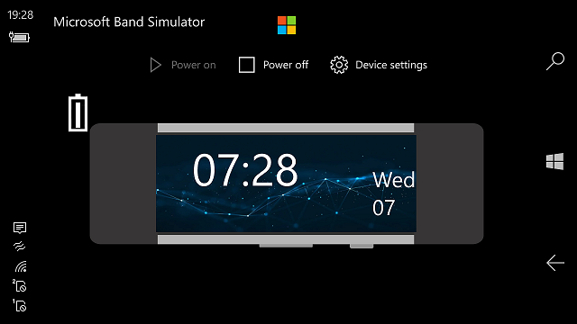
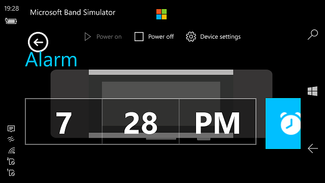

# :: Microsoft Band 3 ::

Forked from [MS Band Simulator](https://github.com/Pdawg-bytes/MSBand-Simulator).

Ported to Win10Mobile. Tweaked a little (to mythic MS Band 3). 

## Screenshots

## About original

MSBand-Simulator is a fully open source simulator for the Microsoft Band's UI that allows for the user to demo the Microsoft Band products and also test basic functions like the music controller or the notfications. **Disclaimer:** This is NOT an emulator for the Band and it does NOT emulate the firmware. This is a full UI simulation in C# and XAML. This app is built in UWP with WinUI 2.1.

## About MicrosoftBand3 solution "concept" (my 2 cents)
- Drived by MicrosoftLumia / ARM / Win10Mobile 
- Some MS Band 1/2 (and "frozen" 3)) planned to be simpuletad/emulated/developed...

# Building

-To build this app, you need the Windows10SDK 19041 installed and UWP support in Visual Studio 2022. 
-Set min. supported Windows10SDK to 15063 (hellow from Lumia 950))
-That's all to build =)

## Credits // Referencies 

https://github.com/Pdawg-bytes Pdawg, an aspiring software developer hoping to work at Microsoft :)

https://github.com/Pdawg-bytes/MSBand-Simulator The priginal MS Band Simulator project with great UI design, IMHO!

## .

AS IS. No support. Proto / Creative mode / DIY :)

## ..

[m][e] 2022

